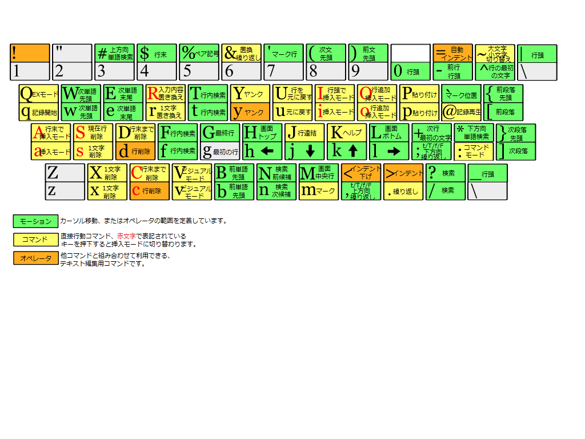

# Vim Cheat Sheet

 [Vim Cheat Sheet](https://vim.rtorr.com/) より

[Vimの使い方 よく使うコマンドまとめ | Memo on the Web](http://motw.mods.jp/Vim/command.html) このページにのってないのも。

日本語向け画像も拾ってきたが、Macだし微妙に違うかも。

  


## 全般

| Key/Command   | Description                   |
| ------------- | ----------------------------- |
| :help keyword | 「keyword」のヘルプを開く     |
| :saveas file  | 名前を付けて保存              |
| :close        | 現在のペインを閉じる          |
| K             | カーソル位置の単語のmanを開く |


## カーソル移動

| Key/Command | Description                                                  |
| ----------- | ------------------------------------------------------------ |
| h           | 左に移動                                                     |
| j           | 下に移動                                                     |
| k           | 上に移動                                                     |
| l           | 右に移動                                                     |
| H           | 画面の先頭行へ移動(Home)                                     |
| M           | 画面の中央行へ移動(Middle)                                   |
| L           | 画面の最下行へ移動(Last)                                     |
| w           | 単語の先頭へジャンプ（区切り文字まで）                       |
| W           | 単語の先頭へジャンプ（区切り文字を含めない）                 |
| e           | 単語の最後にジャンプ（区切り文字まで）                       |
| E           | 単語の最後にジャンプ（区切り文字を含めない）                 |
| b           | 単語の先頭へ戻る（区切り文字まで）                           |
| B           | 単語の先頭へ戻る（区切り文字を含めない）                     |
| f(文字)     | カーソルがある行の(文字)に移動 (Find)                        |
| F(文字)     | カーソルがある行の(文字)に移動(逆向き)                       |
| %           | 対応するカッコに移動（標準でサポートしているペアは: '（）', '{}', '[]' - 詳細は `:h matchpairs` を参照） |
| 0 （ゼロ）  | (行頭)先頭に移動                                             |
| ^           | (行頭)行の最初の文字へ移動                                   |
| $           | (行末)行の終わりへ移動                                       |
| g_          | 行の最後の非空白文字へ移動                                   |
| gg          | ドキュメントの先頭行へ移動                                   |
| G           | ドキュメントの最終行へ移動（番号を付けるとその行へ移動- 5Gは 5行目へ） |
| 88G         | 88行目                                                       |
| fx          | 次の文字「x」の前にジャンプ                                  |
| tx          | 次の文字「x」の1文字前にジャンプ                             |
| Fx          | 前の文字「x」の前にジャンプ                                  |
| Tx          | 前の文字「x」の後にジャンプ                                  |
| ;           | 直前のf, t, F, Tの繰り返し                                   |
| ,           | 直前のf, t, F, Tの繰り返し（反対方向）                       |
| }           | 次の段落へジャンプ（コード編集中の場合は関数/ブロック）      |
| {           | 前の段落へジャンプ（コード編集中の場合は関数/ブロック）      |
| zz          | カーソル位置を画面中央にする                                 |
| Ctrl + e    | 画面を下に1行スクロール（カーソル移動なし）                  |
| Ctrl + y    | 画面を上に1行スクロール（カーソル移動なし）                  |
| Ctrl + b    | (Up)1画面分上に移動                                          |
| Ctrl + f    | (Down)1画面分下に移動                                        |
| Ctrl + d    | (Down)1/2画面分下に移動                                      |
| Ctrl + u    | (Up)1/2画面分上に移動                                        |

- **Tip** これらのコマンドの前に番号を付けるとその回数分繰り返します。例えば、4j は 4行下に移動します。

  

## 挿入モード - テキストを追加/挿入

| Key/Command | Description                                    |
| ----------- | ---------------------------------------------- |
| i           | カーソル位置で挿入モードを開始                 |
| I           | 行の先頭で挿入モードを開始                     |
| a           | カーソル位置の直後で挿入モードを開始           |
| A           | 行の末尾で挿入モードを開始                     |
| o           | 現在の行の下に空白行を追加して挿入モードを開始 |
| O           | 現在の行の上に空白行を追加して挿入モードを開始 |
| ea          | 単語の末尾で挿入モードを開始                   |
| Esc         | コマンドモードに戻る(挿入モードを終了)         |
| ctrl + [    | コマンドモードに戻る                           |
| ctrl + z    | vim を一時停止する                             |
| R           | 上書きモードへ                                 |


## 編集

| Key/Command | Description                                                  |
| ----------- | ------------------------------------------------------------ |
| r           | 単一の文字を置き換える（挿入モードを使用しません）           |
| J           | 現在の行に下の行を連結する（スペースが1文字入る）            |
| gJ          | 現在の行に下の行を連結する（スペースが入らない）             |
| gwip        | 段落をリフロー                                               |
| cc          | 現在の行を削除して挿入モードを開始                           |
| C           | カーソル位置から行末までを削除して挿入モードを開始           |
| c$          | カーソル位置から行末までを削除して挿入モードを開始           |
| ciw         | カーソル位置の単語を全て削除して挿入モードを開始             |
| cw          | カーソル位置の単語を削除して挿入モードを開始                 |
| s           | カーソル位置の文字を削除して挿入モードを開始                 |
| S           | 現在の行を削除して挿入モードを開始（<kbd>cc</kbd>と同じ）    |
| xp          | xp - カーソル位置と次の文字を入れ替える（技術的にはカットしてペースト） |
| u           | 元に戻す（アンドゥ）                                         |
| Ctrl + r    | やり直し（リドゥ）                                           |
| .           | 最後に使ったコマンドを行う(直前の変更を繰り返す)             |


## テキストの選択（ビジュアルモード）

| Key/Command | Description                                                  |
| ----------- | ------------------------------------------------------------ |
| v           | ビジュアルモード開始。移動すると選択してその後にコマンドを実行できる（例えばY-ヤンク） |
| V           | 行単位のビジュアルモードを開始(ラインモード)                 |
| Ctrl + v    | 矩形ビジュアルモードを開始(ブロックモード)                   |
| o           | 選択範囲の反対側に移動する                                   |
| O           | ブロックの他のコーナーに移動する                             |
| aw          | 単語をマーク                                                 |
| ab          | a block with ()                                              |
| aB          | {}ブロックを選択（括弧ごと）                                 |
| ib          | () ブロックを選択（括弧を除く）                              |
| iB          | {}ブロックを選択（括弧を除く                                 |
| Esc         | ビジュアルモード終了                                         |


## レジスタ（コピペのヒストリー）

| Key/Command | Description                  |
| ----------- | ---------------------------- |
| :reg        | レジスタの中身を表示一覧表示 |
| "xy         | レジスタxへヤンク（コピー）  |
| "xp         | レジスタxをペースト          |

- **Tip** レジスタは ~/.viminfo に保存され、次回起動時に読み込まれます。

- **Tip** レジスタ0は常に最新のヤンク（コピー）の値です。

  

## マーク（ブックマーク）

| Key/Command | Description                   |
| ----------- | ----------------------------- |
| :marks      | マークの一覧                  |
| ma          | 現在の位置をマーク「a」に設定 |
| `a          | マーク「a」にジャンプ         |
| y`a         | マーク「a」の位置にヤンクする |


## マクロ

| Key/Command | Description                  |
| ----------- | ---------------------------- |
| qa          | マクロ「a」を記録開始        |
| q           | マクロの記録を停止           |
| @a          | マクロ「a」を実行            |
| @@          | 最後に実行したマクロを再実行 |


## カット＆ペースト

| Key/Command | Description                                              |
| ----------- | -------------------------------------------------------- |
| yy          | 現在の行をヤンク（コピー）                               |
| 2yy         | 2行をヤンク                                              |
| yw          | 単語中の現在のカーソル位置から後の文字をヤンク（コピー） |
| y$          | 現在行の行末までヤンク                                   |
| p           | カーソル位置の後にペースト                               |
| P           | カーソル位置の前にペースト                               |
| dd          | 現在の行をカット（コピーして削除）                       |
| 2dd         | 2行をカット                                              |
| dw          | 単語中のカーソル位置から後の文字をカット                 |
| D           | カーソル位置から行末までカット                           |
| d$          | カーソル位置から行末までカット（<kbd>D</kbd>と同じ）     |
| x           | 現在の文字をカットする                                   |
| yy5p        | 現在の行をコピーし、下に5行追加する                      |
| gv          | 直前の選択範囲を再選択                                   |


## 終了

| Key/Command     | Description                                      |
| --------------- | ------------------------------------------------ |
| :w              | 終了せずに保存                                   |
| :w !sudo tee %  | sudoを使って現在のファイルを保存                 |
| :wq or :x or ZZ | 保存して終了                                     |
| :q              | 保存せずに終了（変更点がある場合は終了できない） |
| :q! or ZQ       | 保存せずに終了（変更点がある場合は破棄される）   |
| :wqa            | 全てのタブを保存して終了                         |


## 検索/置換

| Key/Command    | Description                                                  |
| -------------- | ------------------------------------------------------------ |
| /pattern       | /文字列 - 文字列を検索 後方検索                              |
| ?pattern       | 文字列を逆方向に検索 前方検索                                |
| \vpattern      | 'very magic' エスケープシーケンスなしに正規表現のメタ文字を解釈する |
| n              | 同じ方向に再検索                                             |
| N              | 逆方向に再検索                                               |
| :%s/old/new/g  | ファイル全体でoldをnewに置き換える　`%` はファイル全体を表す。 |
| :%s/old/new/gc | ファイル全体でoldをnewに置き換える（確認あり）               |
| :noh           | 検索結果のハイライトを消す                                   |
| *              | カーソル下の単語を検索                                       |
| \#             | カーソル下の単語を検索 (上方向に検索)                        |
| Ctrl + p       | 単語補完(前方検索)                                           |


## 複数ファイル検索

| Key/Command                   | Description                                              |
| ----------------------------- | -------------------------------------------------------- |
| :vimgrep /pattern/ {`{file}`} | 複数ファイルで pattern を検索 (e.g. :vimgrep /foo/ **/*) |
| :cn                           | 次の該当箇所へジャンプ                                   |
| :cp                           | 前の該当箇所へジャンプ                                   |
| :copen                        | 該当箇所一覧のウインドウを開く                           |


## 複数のファイルでの作業(ウインドウ操作)

| Key/Command   | Description                                            |
| ------------- | ------------------------------------------------------ |
| :e file       | 今いるWindowに新しいバッファでファイルを編集(Edit)     |
| e test*.cc    | ワイルドカードを指定してファイルを開く                 |
| :buffers      | 編集中のバッファ一覧を表示                             |
| :bnext or :bn | 次のバッファに移動                                     |
| :bprev or :bp | 前のバッファへ移動                                     |
| :bd           | バッファを削除（ファイルを閉じる）                     |
| :ls           | バッファのリストを開く                                 |
| :sp file      | 新しいバッファおよび水平分割ウィンドウでファイルを編集 |
| :vsp file     | 新しいバッファおよび垂直分割ウィンドウでファイルを開く |
| :vsplit       | 画面を左右に分割する                                   |
| Ctrl + ws     | ウィンドウを分割                                       |
| Ctrl + ww     | ウィンドウを切り替える                                 |
| Ctrl + wq     | ウィンドウを終了します                                 |
| Ctrl + wv     | ウィンドウを垂直に分割                                 |
| Ctrl + wh     | 右のウィンドウに移動（垂直分割）                       |
| Ctrl + wl     | 左のウィンドウに移動（垂直分割）                       |
| Ctrl + wj     | 下のウィンドウに移動（水平分割）                       |
| Ctrl + wk     | 上のウィンドウに移動（水平分割）                       |


## タブ

| Key/Command                          | Description                                                  |
| ------------------------------------ | ------------------------------------------------------------ |
| :tabnew or :tabnew {page.words.file} | 新しいタブで（ファイル名）を開く                             |
| Ctrl + wT                            | 独自のタブに現在の分割ウィンドウを移動                       |
| gt or :tabnext or :tabn              | 次のタブに移動する                                           |
| :tabprev or :tabp                    | 前のタブに移動する                                           |
| \#gt                                 | タブ番号（n）への移動                                        |
| :tabmove #                           | 位置（n）番目に移動（左端が0）                               |
| :tabclose or :tabc                   | カレントタブを閉じる                                         |
| :tabonly or :tabo                    | カレントタブを除く他のすべてのタブを閉じる                   |
| :tabdo command                       | 全てのタブで `command` を実行（例: `:tabdo q` - 全てのタブを閉じる） |


## その他

| Key/Command   | Description                                                  |
| ------------- | ------------------------------------------------------------ |
| g             | (コマンドの意味)繰り返し                                     |
| c             | (コマンドの意味)1回毎に確認                                  |
| :!command     | 外部コマンドの実行                                           |
| :             | 範囲選択中に `:` を入力すると、選択領域の範囲指定( `’<,’>` )が自動で挿入された状態でコマンドモードに入る。これを置換に利用すると便利。 (例: :'<,'>s/old/new/g) |
| Ctrl + a      | 数値のインクリメント                                         |
| Ctrl + x      | 数値のデクリメント                                           |
| Ctrl-v return | 改行文字の入力                                               |
| Ctrl-v tab    | Tab 文字の入力                                               |


---

# My Configuration

## Plugin keymap

### vim-plug

| Key/Command                | Description                        |
| -------------------------- | ---------------------------------- |
| :PlugInstall ([name ...] ) | プラグインのインストール           |
| :PlugUpdate ([name ...])   | プラグインのインストールまたは更新 |
| :PlugStatus                | プラグインのステータスを確認する   |
| :PlugClean                 | リストにないプラグインを削除します |
| :PlugUpgrade               | vim-plug自体をアップグレードする   |

- 基本は`.vimrc`の中を書き換えて`source .vimrc` する 

  

### fzf

| Key/Command   | Description                                                  |
| ------------- | ------------------------------------------------------------ |
| <space><Tab>  | (fzf-maps-o) map表示                                         |
| \<space><Tab> | (fzf-maps-x) map表示                                         |
| \<space><Tab> | (fzf-maps-n) map表示                                         |
| <Leader>f     | [Fzf] :`<Leader>`(元々は`\` (¥マーク)なのだが、使いやすい`<space>`に変えている)+f<br />このkeymap[Fxf]]だけ`\`になってしまう。原因不明。 |
| <Leader>f f   | Files：ファイルとディレクトリの検索                          |
| <Leader>f g   | GFiles：Gitファイルの検索                                    |
| <Leader>f G   | GFiles?：Gitディレクトリでの検索                             |
| <Leader>f b   | Buffers：現在のバッファ(一時記憶)の検索                      |
| <Leader>f h   | History：過去に開いたファイルを検索                          |
| <Leader>f r   | FZFMru：最近使ったファイルを検索                             |
| :Commands     | Commands:使えるコマンド                                      |
| :Rg           | ripgrepを利用した単語検索(grepの代わり)<br />[rg](https://github.com/BurntSushi/ripgrep)search result (`ALT-A` to select all, `ALT-D` to deselect all)<br />＊ Altが使えないのだけど置き換え方がいまいちわからず<br />ALT-Aがå、ALT-Dが∂。<br />指定した文字列が含まれるor含まれない、とは違うよね？<br />＊:Rg検索中に?を押すとプレビューが見れる。 |
| <C-x><C-k>    | iモードで(fzf-complete-word) cat /usr/share/dict/wordsからの単語補完 |
| <C-x><C-f>    | iモードで(fzf-complete-path) fileとdirのパス補完             |
| <C-x><C-j>    | iモードで(fzf-complete-file) <br />＊RGは使えないみたい(rgにしてもダメ) |
| <C-x><C-l>    | iモードで(fzf-complete-line) 全てのバッファを対象に行を検索して補完 |
| <C-t>         | 絞り込み画面で選んだファイルを新規タブで表示                 |
| <C-x>         | 絞り込み画面で選んだファイルを水平分割して表示               |
| <C-v>         | 絞り込み画面で選んだファイルを垂直分割して表示               |

- その他のコマンドは`:Command>fzf`で見れば良いと思う。

- gitは使うとしてもTerminalの方でちょろっとやるだけ。

  

### NERDTree

| Key/Command | Description                                                 |
| ----------- | ----------------------------------------------------------- |
| <C-e>       | (NERDTreeToggle)NERDTreeの起動  ツリー表示                  |
| o(enter)    | ファイル/ディレクトリを開く                                 |
| t           | タブで開く                                                  |
| m           | mでファイルやディレクトリの追加・削除・コピー・移動ができる |

- 検索はfzf-vimがメインだけど、思い出せないときはツリー表示があった方が便利。

- いろいろあるけど覚えきれないのでこれだけ覚えれば。

  

## Others keymap

- たくさん設定したのはいいものの使いこなせてない、効いてないのもあるかもしれないのが難点。

- :mapで確認できることはできる。かぶっていないと思う。

  

-  行が折り返されている時(set wrap)j kキーによる上下移動が論理行単位ではなく表示行単位で行われるようにする。逆に論理行単位で移動したい場合は、gj, gk

  ```
  nnoremap <silent> j gj
  nnoremap <silent> k gk
  nnoremap <silent> gj j
  nnoremap <silent> gk k
  ```

- Ctrl + hjkl でウィンドウ間を移動

  ```
  nnoremap <silent><C-h> <C-w>h
  nnoremap <silent><C-j> <C-w>j
  nnoremap <silent><C-k> <C-w>k
  nnoremap <silent><C-l> <C-w>l
  ```

- インサートモードでも移動

  ```
  inoremap <silent><C-h> <left>
  inoremap <silent><C-j> <down>
  inoremap <silent><C-k> <up>
  inoremap <silent><C-l> <right>
  inoremap <silent><C-d> <delete>
  ```

- 行を移動

  ```
  nnoremap <C-Up> "zdd<Up>"zP
  nnoremap <C-Down> "zdd"zp
  ```

- 複数行を移動

  ```
  vnoremap <C-Up> "zx<Up>"zP[V]
  vnoremap <C-Down> "zx"zp[V]
  ```

- 貼り付けたテキストの末尾へ自動的に移動する(nvモード)

  ```
  noremap <silent> y y]
  noremap <silent> p p]
  ```

- x,Xでカーソル文字を削除する際レジスタを汚さない(nvモード)

  ```
  noremap x "x
  noremap X "X
  ```

- s,Sでカーソル文字を削除する際レジスタを汚さない(nvモード)

  ```
  noremap s "s
  noremap S "S
  ```

- 検索後に「次の（前の）検索候補」を画面の中心に表示する

  ```
  nnoremap n nzz
  nnoremap N Nzz
  nnoremap * zz
  nnoremap # #zz
  nnoremap g gzz
  nnoremap g# g#zz
  ```

- 閉じ括弧自動保管([ って打ったら [] って入力されてしかも括弧の中にいる)

  ```
  inoremap { {}<LEFT>
  inoremap [ []<LEFT>
  inoremap ( ()<LEFT>
  inoremap " ""<LEFT>
  inoremap ' ''<LEFT>
  ```

- Yでカーソル位置から行末までヤンク(vim内でのコピー)する

  ```
  nnoremap <silent>yy y
  ```

- 入力モード中に素早くjjと入力した場合はESCとみなす

  ```
  inoremap <silent>jj <Esc>
  ```

- ESCを二回押すことでハイライトを消す

  ```
  nmap <silent><ESC><ESC> :nohlsearch<CR><ESC>
  ```

- 選択した文字列を検索

  ```
  vnoremap <silent> // y/<C-R>=escape(@", '\/.*$^~[]')<CR><CR>
  ```

- カーソル下のキーワードをヘルプでひく

  ```
  nnoremap <C-i><C-i> :<C-u>help<Space><C-r><C-w><Enter>
  ```

- <Leader>に<space>を使用

  ```
  let g:mapleader = "\<space>"
  ```

- <Leader>w、でファイル保存

  ```
  nnoremap <Leader>w :w<CR>
  ```

- <Leader>o、で新しいファイルを開く

  ```
  nnoremap <Leader>o :o<CR>
  ```

- <Leader>.でvimrcを開く

  ```
  nnoremap <Leader>. :new ~/.vimrc <CR>
  ```

- <Leader>soで:source ~/.vimrc

  ```
  nnoremap <Leader>so :source ~/.vimrc<CR>
  ```

- <Leader>cと<Leader>v、でシステムのクリップボードにコピー＆ペーストする

  ```
  vmap <Leader>y "+y
  vmap <Leader>d "+d
  map <Leader>p "+p
  map <Leader>P "+P
  ```

- <Leader>j, <Leader>kで画面送り

  ```
  noremap <Leader>j <c-f><cr><cr>
  noremap <Leader>k <c-b><cr><cr> 
  ```

- 押しにくいキー 行の先頭^/行の末尾$/ */%

  ```
  noremap <Leader>h ^
  noremap <Leader>l $
  nnoremap <Leader>/  *
  noremap <Leader>m  %
  ```

- 誤操作すると困るキーを無効化する(ZZ(保存して閉じる)とZQ(保存せず閉じる)、Qでexモードに入れるがモードを変えられなくなる)

  ```
  nnoremap ZZ <Nop>
  nnoremap ZQ <Nop>
  nnoremap Q 	<Nop>
  nnoremap gq <Nop>
  ```

- カーソル下の単語を、置換後の文字列の入力を待つ状態にする

  ```
  nnoremap <Leader>re :%s;<<C-R><C-W>>;g<Left><Left>
  ```

  

---


